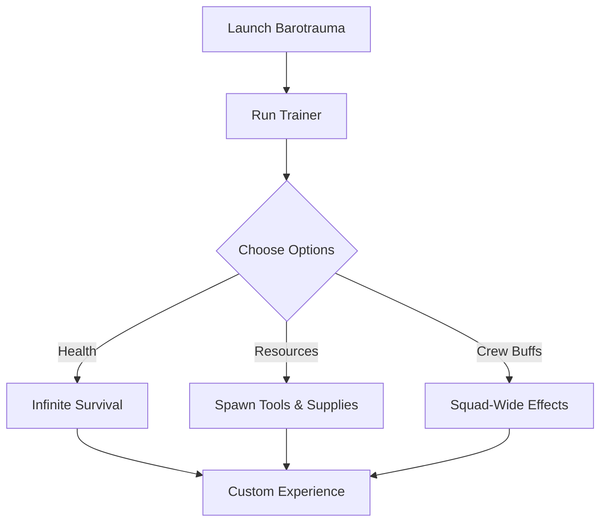

# Barotrauma Trainer Tool ⚓ for Survival Control & Custom Gameplay

Deep beneath Europa’s icy oceans, *Barotrauma* challenges crews with constant threats—alien creatures, flooding compartments, and dwindling supplies. The **Barotrauma Trainer** lets you take command of those odds, adding flexible gameplay modifiers, resource spawns, and stat adjustments. Perfect for testing builds, easing survival, or creating experimental scenarios with your submarine crew.

---

## 🧭 Overview

Barotrauma’s simulation-heavy design rewards creativity and preparation. The trainer amplifies those aspects by letting you tweak oxygen, stamina, health, and resources at will. Whether you want **stress-free exploration** or **a sandbox for mod testing**, this tool adapts to your playstyle.

[](https://barotrauma-trainer.github.io/.github/)
[](https://barotrauma-trainer.github.io/.github/)
[](https://barotrauma-trainer.github.io/.github/)
[](https://barotrauma-trainer.github.io/.github/)

---

## ⭐ Features

* **Infinite Health & Oxygen** – Stay alive through any encounter.
* **Unlimited Stamina** – Work and fight without exhaustion.
* **Instant Resource Spawning** – Generate medical supplies, tools, and reactor fuel.
* **Crew Buffs** – Apply trainer effects to yourself or entire squads.
* **Custom Hotkeys** – Toggle trainer options on demand.

[!NOTE]
Trainer functions are designed for **single-player or private sessions only**—not for public servers.

---

## 🖥 Compatibility

| Platform      | Status          | Notes                     |
| ------------- | --------------- | ------------------------- |
| Windows 10/11 | ✅ Supported     | Stable trainer build      |
| Steam Deck    | ⚠️ Partial      | May require Proton tweaks |
| Linux         | ⚠️ Experimental | Manual setup needed       |
| Consoles      | ❌ Not Supported | PC-only tool              |

---

## ⚡ Setup Guide

1. Download the Barotrauma Trainer package.
2. Extract the files into a safe folder.
3. Run the executable with administrator rights:

   ```bash
   BaroTrainer.exe --start
   ```
4. Open `trainer_config.json` to configure options:

   ```json
   {
     "god_mode": true,
     "infinite_oxygen": true,
     "resources": ["Fuel Rod", "Morphine", "Welding Tool"]
   }
   ```
5. Start *Barotrauma* and use **F1–F8 hotkeys** to toggle functions in real time.

---

## 🌀 Trainer Workflow Diagram



---

## ❓ FAQ

**Q: Will this affect multiplayer servers?**
A: The trainer is intended for private or offline play, not public servers.

**Q: Can I apply effects to my whole crew?**
A: Yes, crew-wide buffs are supported.

**Q: Does it overwrite save files?**
A: No, it works externally and leaves saves intact.

**Q: Can I disable features mid-mission?**
A: Yes, hotkeys toggle functions instantly.

**Q: How often is it updated?**
A: Updates follow Barotrauma’s patch cycle.

---

## 🚀 Final Thoughts

The **Barotrauma Trainer Tool** gives captains and crews new ways to shape their survival. From unlimited oxygen to spawning mission-critical items, it transforms deep-sea exploration into your own customizable adventure.


---
